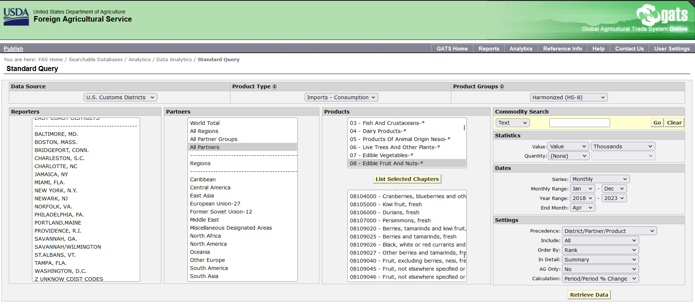
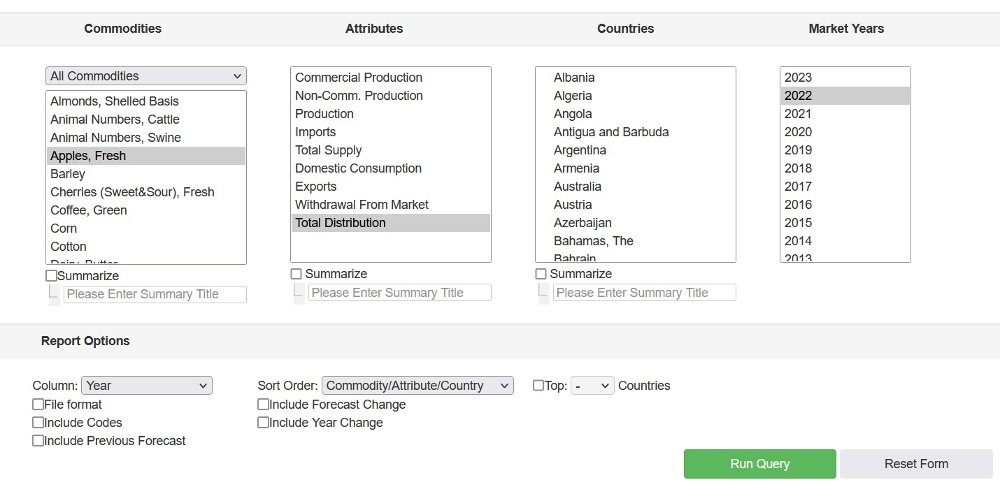

- [FAS Open Data Services](#fas-open-data-services)
  - [US Export Sales Reporting (ESR) Data](#us-export-sales-reporting-esr-data)
  - [Global Agricultural Trade System (GATS) Data](#global-agricultural-trade-system-gats-data)
    - [Data sources of GATS](#data-sources-of-gats)
    - [Product types of GATS](#product-types-of-gats)
    - [Product Groupings](#product-groupings)
  - [Production, Supply \& Distribution (PSD) Data](#production-supply--distribution-psd-data)
- [Proof of Concept](#proof-of-concept)
  - [Who are our users and what are their decisions?](#who-are-our-users-and-what-are-their-decisions)
  - [Initial questions from the data survey](#initial-questions-from-the-data-survey)
  - [Examples in the market with similar data](#examples-in-the-market-with-similar-data)

# [FAS Open Data Services](https://apps.fas.usda.gov/opendata/swagger/ui/index#/)

## [US Export Sales Reporting (ESR) Data](https://apps.fas.usda.gov/esrQuery/esrq.aspx)
USDA's Export Sales Reporting Program monitors U.S. agricultural export sales on a daily and weekly basis. Export sales reporting provides a constant stream of up-to-date market information for 40 U.S. agricultural commodities sold abroad.

A single statistic reveals the significance of the program: in a typical year, the program monitors more than 40 percent of total U.S. agricultural exports. The program also serves as an early alert on the possible impact foreign sales have on U.S. supplies and prices.

The weekly U.S. Export Sales report is the most currently available source of U.S. export sales data. The data is used to analyze the overall level of export demand, determine where markets exist, and assess the relative position of U.S. commodities in foreign markets. 

PRO's: Weekly exports \
CON's: Limited commodities

## [Global Agricultural Trade System (GATS) Data](https://apps.fas.usda.gov/gats/ExpressQuery1.aspx)

[*Query builder*](https://apps.fas.usda.gov/gats/ExpressQuery1.aspx)

The Global Agricultural Trade System (GATS) is a searchable database containing monthly U.S. Census Bureau trade data organized by agricultural commodity and agricultural related product groups. Trade data is searchable by partners countries and partner groups. Historical U.S. agricultural trade data is available back to 1967. Two Month Delay.

In addition, United Nations trade statistics (UN Comtrade) may be queried through GATS. UN trade data is available for nearly 200 countries or areas, dating from the inception of the Harmonized System (HS) of trade codes in 1989 to present. Yearly on an HS6 level.

The database is continuously updated. U.S. trade data is updated monthly according to the U.S. Census Bureau’s reporting system. UN Comtrade data are updated in GATS after nationally submitted data to the UN are standardized by the UN Statistics Division and added to UN Comtrade database.

### Data sources of GATS
[*U.S. Census documentation*](https://www.census.gov/foreign-trade/guide/sec2.html), [*U.S. Census API*](https://www.census.gov/data/developers/data-sets/international-trade.html)

FAS U.S. Trade
U.S. Customs Districts
U.S. States

| Data Source | Product Type | Frequency |
| ------------|--------------|--------------|
| FAS U.S. Trade | Exports, Imports Consumption, Imports General, Re-Exports | Monthly |
| U.S. Customs Districts |  Exports, Imports Consumption, Imports General, Re-Exports | Monthly |
| U.S. States | Exports | Monthly |
| UN ComTrade | Exports, Imports | Yearly |

### Product types of GATS
1. **Export (domestic)** include (1) commodities which are grown, produced, or manufactured in the United States and (2) commodities of foreign origin which have undergone substantial transformation in the United States from the form in which they were imported.
2. **Import (consumption)** measures the total value of the end-use product that physically clears Customs, or goods withdrawn from Customs bonded warehouses or U.S. Foreign Trade Zones, which immediately enter consumption channels.
3. **Import (general)** measures the total value of merchandise shipments that arrive in the U.S. from foreign countries, whether such merchandise enters consumption channels immediately or is entered into bonded warehouses and later transshipped or Foreign Trade Zones under Customs custody.
4. **Re-exports** consist of commodities of foreign origin which (1) have entered the United States for consumption, into Customs bonded warehouses, or U.S. Foreign Trade Zones and (2) at the time of exportation are in the same condition as when imported.

*The international Harmonized System (HS) is administered by the World Customs Organization and serves as the foundation for the import and export classification systems used in the United States. The U.S. import classification system, the Harmonized Tariff Schedule (HTS) administered by the U.S. International Trade Commission (USITC), and the U.S. export classification system, the Schedule B administered by the U.S. Census Bureau, Foreign Trade Division, both rely on the international HS codes for their 4- and 6-digit headings and subheadings.*

### Product Groupings

1. **BICO (HS10)** is based on aggregates categorized as (B)ulk, (I)ntermediate, or (C)onsumer-(O)riented products. It is also the default product group on the GATS standard query page at the U.S. 10-digit level.
1. **BICO (HS6)** is a variation of the "BICO (HS10)", but at the 6-digit level, which can be used to compare aggregates across different country reporters with either UN or TDM data. It can also be used to compare exports and imports using the same aggregate definitions.
1. **FAS** provides additional query options with more detailed commodity aggregates using 10-digit level codes (including breakouts for specific grains, oilseeds, livestock products, and more).
1. **FAS Legacy Group** is based on USDA's definition of traded agricultural products at the 10-digit level prior to the adoption of the WTO agricultural definition.
1. **FATUS** the Foreign Agricultural Trade of the United States (FATUS) is a system of 211 trade aggregates created by the Economic Research Service summarizing U.S. agricultural trade. Similar to the FAS product group, this group provides an additional selection of detailed aggregates based on 10-digit level codes (including breakouts for specific fruits and vegetables).
1. **FATUS Legacy** is based on USDA's definition of traded agricultural products at the 10-digit level prior to the adoption of the WTO agricultural definition.
1. **Harmonized (HS-2)** allows users to select 2-digit chapters in the Harmonized System.
1. **Harmonized (HS-4)** allows users to select 4-digit headings in the Harmonized System.
1. **Harmonized (HS-6)** allows users to select 6-digit subheadings in the Harmonized System.
1. **Harmonized (HS-8)** available for imports only, the group allows users to select 8-digit import codes based on the U.S. Harmonized Tariff Schedule (USHTS).
1. **Harmonized (HS-10)** allows users to select commodities at the 10-digit level based on the U.S. Census Schedule B codes for exports, and the U.S. International Trade Commission USHTS codes for imports.
1. **Organics** - Selected lists organic aggregates, including organic lemons, pears, and tomatoes.
1. **Processed Food*** lists processed product aggregates, including baby food, chocolates, and prepared/preserved meats.
1. **Ag Sectors (HS-6)**-* is based on agricultural sectors at the 6-digit level and the WTO ag definition total. 

## [Production, Supply & Distribution (PSD) Data](https://apps.fas.usda.gov/psdonline/app/index.html#/app/about)
[*Query builder*](https://apps.fas.usda.gov/psdonline/app/index.html#/app/advQuery)

Foreign Agricultural Service (FAS’s) PSD Online data for those commodities published in the WASDE Report are reviewed and updated monthly by an interagency committee chaired by USDA’s World Agricultural Outlook Board (WAOB), and consisting of: the Foreign Agricultural Service (FAS), the Economic Research Service (ERS), the Farm Service Agency (FSA), and the Agricultural Marketing Service (AMS).

The international portion of the data **is updated with input from agricultural attachés** stationed at U.S. embassies around the world, FAS commodity analysts, and country and commodity analysts with ERS. The U.S. domestic component is updated with input from analysts in FAS, ERS, the National Agricultural Statistical Service, and FSA. Interagency work on the database is carried out under the aegis of the WAOB.

The official USDA supply and use data is published monthly in: WAOB, World Agricultural Supply and Demand Estimates (WASDE); in the foreign agricultural commodity circular series issued by FAS; and in the regional situation and outlook reports and monthly commodity newsletters of ERS (see keywords Crops and Animal Products) data for horticultural products are usually published twice a year. 

Reports on high level commodity categories

1. Commercial Production
1. Non-Comm. Production
1. Production
1. Imports
1. Total Supply
1. Domestic Consumption
1. Exports
1. Withdrawal From Market
1. Total Distribution

# Proof of Concept
There are many places to start, but the best is to start with the highest value target, that delivers the quickest return. If the scope is too large, this can take long and momentum fails.

Suggestion to scope an initial proof of concept and then to build the product out from there as the appetite grows.

## Who are our users and what are their decisions?

* Who are the user groups of Prophet US currently?
  * Function
  * Role
  * Authority and actions
* What actions should this data inform?

## Initial questions from the data survey 
* Focus on Imports / exports
  * Imports - consumption / general?
  * Exports - production from each state
* Timeliness of report (GATS vs ESR)
* Product grouping

## Examples in the market with similar data

Existing data dashboards using the FAS data are interactive and open. To distinguish from other data visualisers, we need to provide an additional value to the openly accessible data.

* [UN comtradeplus](https://comtradeplus.un.org/)
* [Harvard Atlas](https://atlas.cid.harvard.edu/)
* [STERN Fatmaps](https://globalization.stern.nyu.edu/maps?country=ZAF&indicator=mx&year=2021&color=default)
* [Asia Pacific Energy](https://asiapacificenergy.org/apef/index.html#main/lang/en/graph/8/type/2/sort/0/time/[1999,2014]/indicator/[8521:7770]/geo/[RUS]/legend/1/inspect/0)
* [Global Commodities](https://www.dailyfx.com/research/global-commodities/globe)

Is the value the data, or the context it provides for the decision makers using PR3? Or is it just easy access to the data?